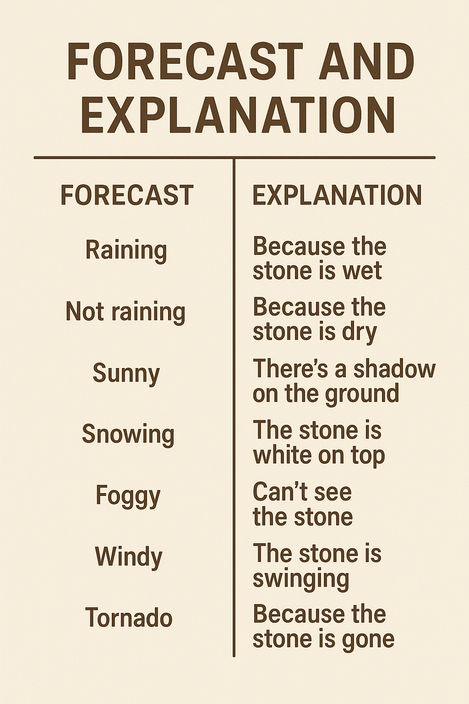

# Forecast Explanation

Project aiming to provide some plain explanations to weather forecasts by using some XAI.

    

## Repo structure

|-- **GRIB_data**  -> contains the GRIB data files (ignored) and scripts to generate feature maps  
|-- **image_processing**  -> contains the generated feature maps and scripts to extract relevant features

## TODO list

* [ ] GRIB data extraction
* [ ] Feature map generation (at different heights)
* [ ] Complete 'Cloud'/high feature extraction from featuremaps
* [ ] Track features through frames
* [ ] ...
