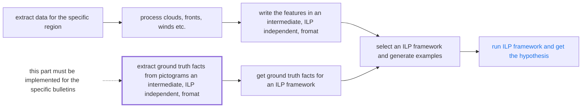

# SERGIO, Forecast Explanation

SERGIO (<b>S</b>imlulating <b>E</b>xplanation of <b>R</b>e<b>GIO</b>nal weather forecast) is framework aiming to provide simple explanations to weather forecasts made by experts (leveraging Machine learning), by using Inductive logic programming.

<div align="center">

</div>

## Installation

To run the framework clone the repository, change the parameters for the learning task and run docker:

```bash
# 1. Clone
git clone https://github.com/EnrSanti/ForecastExplanation.git
cd ./ForecastExplanation

# 2. Configure credentials (CDS API key for CERRA GRIB downloads)
echo "CDSAPI_URL=https://cds.climate.copernicus.eu/api" >> .env
echo "CDSAPI_KEY=<your-personal-access-token>" >> .env

# 3. Edit config.yaml with your desired run(s) (region, dates, flags)

# 4. Build
docker compose build

# 5. Run
docker compose up
```

A CDS API key is required for CERRA GRIB downloads — see the [CDS API setup guide](https://cds.climate.copernicus.eu/how-to-api) and place your credentials in the file `.env`.

## Training Configuration

Use the file `config.yaml` to set up a run for a specific region.
Runs are configured via `config.yaml`. Each top-level key names a run, with the following options set per region/date combination:

| Key | Type | Description |
|---|---|---|
| `region.bounds` | `[LONG_MIN, LONG_MAX, LAT_MIN, LAT_MAX]` | Geographical bounding box to extract and process |
| `region.cities` | map of `city: {lat, lon}` | Named cities within the region, used for per-city feature/label extraction and overlays |
| `dates` | list of `YYYY-MM-DD` | Dates to analyze |
| `clean` | `true` \| `false` | Remove downloaded `.GRIB` files after processing |
| `clustering` | `true` \| `false` | Run TOBAC on clustered images instead of raw ones |
| `debug` | `true` \| `false` | Enable debug logging |
| `just_cut` | `true` \| `false` | Only download and cut the GRIB files, skipping feature extraction/clustering |
| `save_images` | `true` \| `false` | Save TOBAC's input/output images, for visually checking detection quality |

## Current pipeline

```mermaid
flowchart LR
    A["extract data for the specific region"] --> B["process clouds, fronts, winds etc."]
    B --> C["write the features in an intermediate, ILP independent, fromat"]
    C --> E["select an ILP framework and generate examples"]
    E --> F["run ILP framework and get the hypothesis"]

    G["extract ground truth facts from pictograms an intermediate, ILP independent, fromat"]:::highlight --> H["get ground truth facts for an ILP framework"]
    H --> E

    N["this part must be implemented for the specific bulletins"] -.-> G

    class F blue
    classDef highlight stroke-width:3px
    classDef blue color:#1a73e8
    class N noBorder
    classDef noBorder stroke:none,fill:none
```