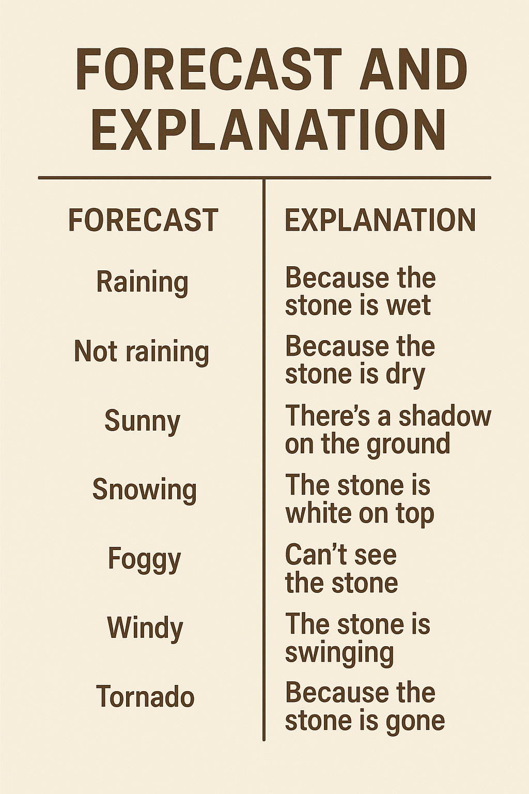

# Forecast Explanation

Project aiming to provide some plain explanations to weather forecasts by using some XAI.

    

## Repo structure

|-- **GRIB**  -> contains the GRIB data files (.ignored) and scripts to extract data generate feature maps, <a href="https://cds.climate.copernicus.eu/datasets/reanalysis-cerra-pressure-levels?tab=overview">the dataset</a>.  
|-- **image_processing**  -> contains the generated feature maps and scripts to extract relevant features.

## TODO list

* [X] GRIB data extraction
* [X] Feature map generation (at different heights)
* [X] Complete 'Cloud'/high feature extraction from featuremaps
* [X] Track features through frames
* [ ] Additional Image processing (simplify through polygons) 
* [ ] Track Split/merge (by hand(?))
* [ ] Bring concepts to facts
* [ ] ILP/ASP model
* [ ] NLP translation (?)
