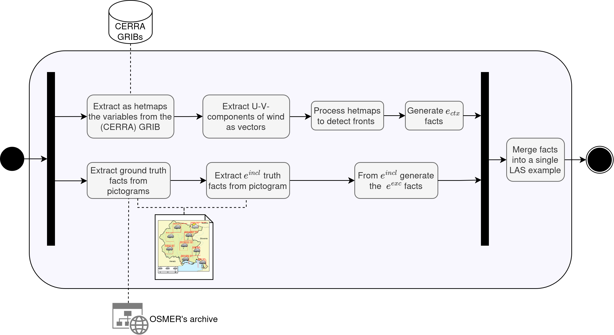

# Forecast Explanation

Project aiming to provide some plain explanations to weather forecasts made by experts (leveraging Machine learning), by using Inductive logic programming.
Starting 

    

## Repo structure

|-- **raw_data**  -> contains the GRIB data files (.ignored) and scripts to extract data generate feature maps, <a href="https://cds.climate.copernicus.eu/datasets/reanalysis-cerra-pressure-levels?tab=overview">the dataset is here</a>.  
|-- **image_processing**  -> contains the generated feature maps and scripts to extract relevant features via TOBAC.  
|-- **reasoning** -> contains the scripts to extract ASP facts from the features and the facts generated.

## Installation

git clone https://github.com/EnrSanti/ForecastExplanation.git

To use the pipeline, create a conda environment with the script create_conda_env.sh.
To process data, execute the main file after putting under /raw_data/data/original_CERRA the grib files from which extract raw data and under /reasoning/pictogram_extraction/pictograms/sky the pictograms for the same dates.

## Current pipeline

    

* [X] GRIB data extraction
* [X] Feature map generation (at different heights)
* [X] Complete 'Cloud'/high feature extraction from featuremaps
* [X] Track features through frames
* [X] Track Split/merge (by hand(?))
* [X] Bring concepts to facts
* [X] Full example generation
* [X] ILP/ASP model
* [ ] NLP translation (?)
